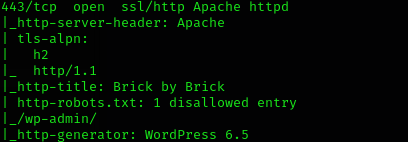

# Bricks Heist

The room is based on the bricks builder plugin of WordPress, vulnerable to a critical security flaw known as CVE-2024-25600. This vulnerability affects all versions up to, and including, 1.9.6 of the Bricks Builder plugin. It exploits the handling of user inputs resulting in Remote Code Execution (RCE).

We start by enumerating using nmap.

Nmap →  nmap -sC -sV 10.10.82.159 

```bash
PORT     STATE SERVICE  VERSION
22/tcp   open  ssh      OpenSSH 8.2p1 Ubuntu 4ubuntu0.11 (Ubuntu Linux; protocol 2.0)
| ssh-hostkey: 
|   3072 0f:f4:d9:7b:1c:2b:77:c2:46:b5:f8:96:4c:87:13:ea (RSA)
|   256 21:f6:c2:4d:fc:fd:62:0f:6a:6b:ab:a0:5f:86:96:45 (ECDSA)
|_  256 a5:af:9f:00:72:77:b3:03:e1:94:20:57:ce:b7:17:64 (ED25519)
80/tcp   open  http     WebSockify Python/3.8.10
| fingerprint-strings: 
|   GetRequest: 
|     HTTP/1.1 405 Method Not Allowed
|     Server: WebSockify Python/3.8.10
|     Date: Wed, 05 Mar 2025 14:48:47 GMT
|     Connection: close
|     Content-Type: text/html;charset=utf-8
|     Content-Length: 472
|     <!DOCTYPE HTML PUBLIC "-//W3C//DTD HTML 4.01//EN"
|     "http://www.w3.org/TR/html4/strict.dtd">
|     <html>
|     <head>
|     <meta http-equiv="Content-Type" content="text/html;charset=utf-8">
|     <title>Error response</title>
|     </head>
|     <body>
|     <h1>Error response</h1>
|     <p>Error code: 405</p>
|     <p>Message: Method Not Allowed.</p>
|     <p>Error code explanation: 405 - Specified method is invalid for this resource.</p>
|     </body>
|     </html>
|   HTTPOptions: 
|     HTTP/1.1 501 Unsupported method ('OPTIONS')
|     Server: WebSockify Python/3.8.10
|     Date: Wed, 05 Mar 2025 14:48:47 GMT
|     Connection: close
|     Content-Type: text/html;charset=utf-8
|     Content-Length: 500
|     <!DOCTYPE HTML PUBLIC "-//W3C//DTD HTML 4.01//EN"
|     "http://www.w3.org/TR/html4/strict.dtd">
|     <html>
|     <head>
|     <meta http-equiv="Content-Type" content="text/html;charset=utf-8">
|     <title>Error response</title>
|     </head>
|     <body>
|     <h1>Error response</h1>
|     <p>Error code: 501</p>
|     <p>Message: Unsupported method ('OPTIONS').</p>
|     <p>Error code explanation: HTTPStatus.NOT_IMPLEMENTED - Server does not support this operation.</p>
|     </body>
|_    </html>
|_http-server-header: WebSockify Python/3.8.10
|_http-title: Error response
443/tcp  open  ssl/http Apache httpd
|_http-server-header: Apache
| tls-alpn: 
|   h2
|_  http/1.1
|_http-title: Brick by Brick
| http-robots.txt: 1 disallowed entry 
|_/wp-admin/
|_http-generator: WordPress 6.5
| ssl-cert: Subject: organizationName=Internet Widgits Pty Ltd/stateOrProvinceName=Some-State/countryName=US
| Not valid before: 2024-04-02T11:59:14
|_Not valid after:  2025-04-02T11:59:14
|_ssl-date: TLS randomness does not represent time
3306/tcp open  mysql    MySQL (unauthorized)
```

The scan reveals two web pages running on ports 80 and 443. Upon examining the second page, we discover a WordPress 6.5 installation with a wp-admin page that is disallowed through robots.txt.



Trying to brute force it using common credentials did not take us anywhere.


Further analysis of the webpage reveals that the target is using version 1.9.5 of the Bricks plugin.

`wpscan --url [https://bricks.thm/](https://bricks.thm/) --disable-tls-checks` 

Disabled TLS check to ensure the attack functions correctly.


 

Looking for an exploit online takes us to :

[`https://github.com/K3ysTr0K3R/CVE-2024-25600-EXPLOIT/blob/main/CVE-2024-25600.py](https://github.com/K3ysTr0K3R/CVE-2024-25600-EXPLOIT/blob/main/CVE-2024-25600.py)` 


Using the exploit returns us a shell. Which is a good starting point.


Looking through the files we find a suspicious file that gave us the first flag.


While searching through running processes for suspicious activity, we stumble upon TRYHACK3M.

`systemctl | grep running`


Following up on it we find the process running: nm-inet-dialog 


Let's examine `inet.conf`, which might contain interesting log information.


This appears to be some kind of bitcoin miner. It contains an ID, which piques our curiosity.


We use cyberchef to try decipher it. This gives us two bitcoin wallet addresses.


```c
bc1qyk79fcp9hd5kreprce89tkh4wrtl8avt4l67qa
bc1qyk79fcp9had5kreprce89tkh4wrtl8avt4l67qa
```

A quick online search reveals information about the transactions, including one particularly large transaction of $352,898.


The wallet addresses provide additional information about the individual, which leads us to discover details about their associated organization.


